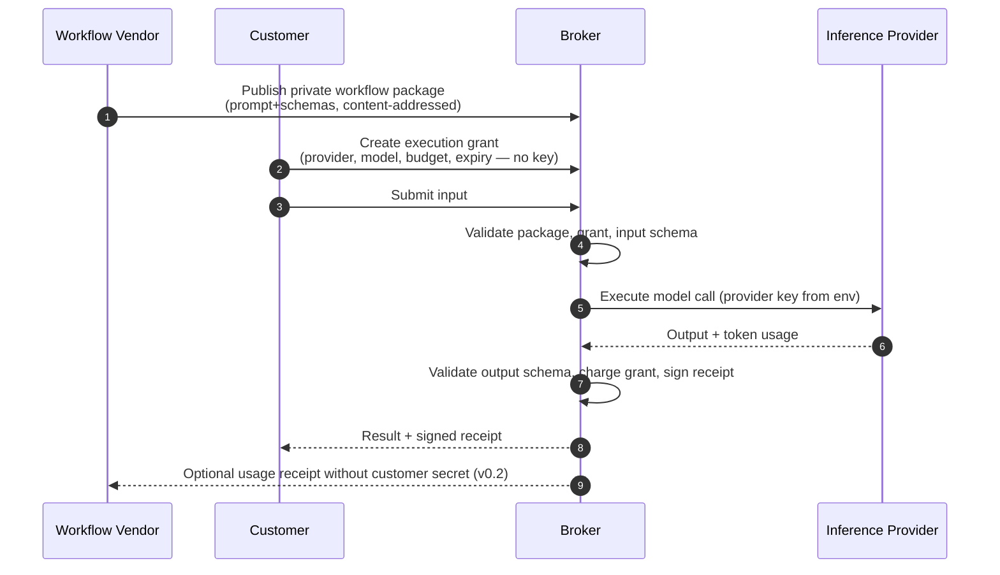
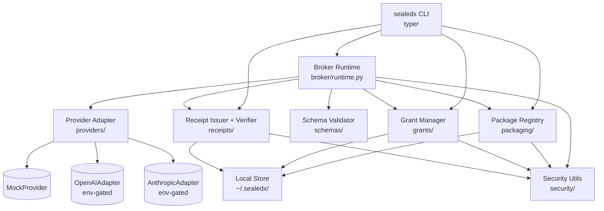

# sealedx

**Delegated private AI workflow execution.** A protocol and reference implementation where one party owns the workflow IP, another party owns the inference account, and a broker executes the workflow with auditability while revealing neither party's secret to the other.

```text
Private workflow package
  + Customer execution grant
  + Broker execution
  + Provider adapter
  + Signed execution receipt
```

> MCP, agent frameworks, and AI app platforms are standardizing how models connect to tools and context. They do not yet standardize how **private workflow IP** and **customer-owned inference spend** can be composed safely. `sealedx` prototypes that missing layer.

---

## Why this matters

A workflow vendor may own proprietary prompt logic, decomposition strategy, evaluator rubrics, or routing policy. An enterprise customer may want to run that workflow against their own approved inference provider account, on their budget, under their governance. Today this collapses to one of three bad options:

| Option | What goes wrong |
|---|---|
| Vendor hosts the workflow and pays for inference | Vendor takes on cost, billing, abuse, and capacity risk. Customer loses governance. |
| Customer self-hosts the workflow | Vendor must ship plaintext prompts. IP is gone day one. |
| Customer gives vendor a long-lived API key | Customer loses spend control, model choice, retention control, and audit. Compliance teams reject this. |

`sealedx` prototypes a fourth option: the customer issues a **bounded execution grant** (provider + model + budget + expiry, no key) and a **broker** executes the vendor's signed workflow package against the customer's provider account, emitting a signed, content-addressed **execution receipt** that anyone can verify.

## What v0 does **not** solve (read this first)

This is a credible v0 prototype, not a production-grade confidential-compute system. v0 is honest about its threat model:

- A malicious broker operator with disk or memory access can read the prompt. v0 is a **trust-based broker**.
- A determined customer can coax the model into echoing the prompt via output. Output-schema validation raises the cost of casual extraction; it does not prevent a determined attempt.
- The provider always sees the prompt. Provider-side retention is out of scope.
- No vendor verification, no transparency log, no key rotation, no enclave attestation in v0.

The protocol — package, grant, receipt — is designed to absorb confidential-compute, attestation, and a public transparency log without changing data shapes. See [`docs/threat-model.md`](docs/threat-model.md) and [`docs/limitations.md`](docs/limitations.md) for the full posture, and [`docs/roadmap.md`](docs/roadmap.md) for what v0.2/v0.3/v1.0 add.

---

## Quickstart

```bash
# Clone and install (Python 3.11+)
git clone https://github.com/AITrekker/inference-broker.git
cd inference-broker
python3 -m venv .venv && source .venv/bin/activate
pip install -e ".[dev]"

# Run the end-to-end demo (no API keys needed — mock provider)
./scripts/demo.sh

# Or run the test suite
./scripts/test.sh
```

The demo packages the in-tree `immersive-video-planner` workflow, issues a $5 / 1h mock-provider grant, executes it on the Roman Colosseum input, and verifies the resulting receipt — all in under 10 seconds.

---

## End-to-end flow



### CLI

```bash
# Vendor: package a workflow (prompt body never printed; only its hash)
sealedx vendor package \
  --name immersive-video-planner \
  --prompt examples/immersive-video-planner/prompt.md \
  --input-schema examples/immersive-video-planner/input.schema.json \
  --output-schema examples/immersive-video-planner/output.schema.json \
  --version 0.1.0 --license Apache-2.0

# Customer: bounded grant. Provider keys live in env, never in the grant.
sealedx customer grant \
  --provider mock --model mock-claude-sonnet-4-5 \
  --budget-usd 5 --expires-in 1h

# Broker: execute. Always emits a signed receipt, even on failure paths.
sealedx broker execute \
  --package-id pkg_... --grant-id grant_... \
  --input examples/immersive-video-planner/input.json

# Anyone: verify the receipt's signature and re-derived hashes
sealedx receipt verify ~/.sealedx/receipts/exec_....json
```

To run against real providers, install the optional extras and export the matching env var:

```bash
pip install '.[openai]'    # then export OPENAI_API_KEY=...
pip install '.[anthropic]' # then export ANTHROPIC_API_KEY=...
sealedx customer grant --provider anthropic --model claude-sonnet-4-6 --budget-usd 5 --expires-in 1h
```

---

## Protocol overview

Three wire-stable data types. The complete spec is in [`docs/protocol.md`](docs/protocol.md).

### WorkflowPackage

Vendor's published artifact. Prompt body is **not** in the document — only its SHA-256.

```json
{
  "protocol_version": "0.1",
  "package_id": "pkg_...",
  "name": "immersive-video-planner",
  "version": "0.1.0",
  "prompt_hash": "sha256:...",
  "input_schema_hash": "sha256:...",
  "output_schema_hash": "sha256:...",
  "required_provider": null,
  "required_models": null,
  "license": "Apache-2.0"
}
```

### ExecutionGrant

Customer's bounded authorization. Carries no API key.

```json
{
  "grant_id": "grant_...",
  "provider": "anthropic",
  "model": "claude-sonnet-4-6",
  "budget_usd": "5.0000",
  "spent_usd": "0.0000",
  "expires_at": "2026-05-15T01:00:00Z",
  "status": "active"
}
```

### ExecutionReceipt

Signed with Ed25519 over canonical JSON (sorted keys, no whitespace) of every field except the signature itself.

```json
{
  "protocol_version": "0.1",
  "receipt_version": "0.1",
  "execution_id": "exec_...",
  "workflow_package_id": "pkg_...",
  "workflow_name": "immersive-video-planner",
  "workflow_version": "0.1.0",
  "prompt_hash": "sha256:...",
  "input_schema_hash": "sha256:...",
  "output_schema_hash": "sha256:...",
  "input_hash": "sha256:...",
  "output_hash": "sha256:...",
  "provider": "mock",
  "model": "mock-claude-sonnet-4-5",
  "tokens_in": 354,
  "tokens_out": 891,
  "estimated_cost_usd": "0.0012",
  "budget_usd": "5.0000",
  "started_at": "2026-05-15T00:00:00Z",
  "completed_at": "2026-05-15T00:00:00.412Z",
  "status": "succeeded",
  "policy_flags": ["cost_estimated:2026-05-15"],
  "broker_public_key_id": "broker-dev-key-1",
  "broker_signature": "base64-..."
}
```

`provider`, `model`, `tokens_in`, `tokens_out` come from the **adapter response**, not the grant request — the receipt records what actually ran, not what was asked. `output_hash` is `null` on non-success statuses. `receipt verify` re-derives every hash where artifacts are available locally; tampering with any signed field breaks verification.

---

## Architecture



The broker runtime is exposed as a library function (`sealedx.broker.runtime.execute(...)`) so a future FastAPI server can wrap it without touching core logic. Full module map and design rationale: [`docs/architecture.md`](docs/architecture.md).

## Provider support

| Provider | Adapter | Gating | Structured output | Status |
|---|---|---|---|---|
| Mock (deterministic, fixture-driven) | `sealedx.providers.mock.MockProvider` | none — always available | yes (synthesizes from output schema) | required |
| OpenAI | `sealedx.providers.openai_adapter.OpenAIAdapter` | `pip install '.[openai]'` + `OPENAI_API_KEY` | JSON Schema response_format | supported |
| Anthropic | `sealedx.providers.anthropic_adapter.AnthropicAdapter` | `pip install '.[anthropic]'` + `ANTHROPIC_API_KEY` | schema-instructed JSON parse | supported |
| Hugging Face | — | — | — | roadmap (v0.2) |
| Local LLM | — | — | — | roadmap (v1.0) |

Adapter contract is a `typing.Protocol` — see [`docs/provider-adapters.md`](docs/provider-adapters.md). Tests do not depend on real APIs. Real-API tests are gated behind `pytest -m live` and not part of CI.

## Threat model summary

Full table in [`docs/threat-model.md`](docs/threat-model.md). Short version:

| Adversary | v0 stance |
|---|---|
| Casual customer (CLI/log access only) | Defended — prompt never displayed, redacting logger |
| Casual vendor (sees usage receipts only) | Defended — keys never travel in any package/grant/receipt |
| Determined customer with shell on broker host | **Not defended** — confidential compute solves this (v0.3) |
| Malicious broker operator | **Not defended** — explicit limitation; production needs attestation |
| Network observer | TLS via provider SDK; no additional in-transit confidentiality from sealedx itself |
| Receipt forger | Defended — Ed25519 over canonical JSON; tampering breaks verification |
| Inference-output prompt extraction | **Not defended** — output classifiers + provider features needed (v0.3) |

Stating the limits is the point. See [`docs/limitations.md`](docs/limitations.md).

## Roadmap

Selected items, in priority order. Full list: [`docs/roadmap.md`](docs/roadmap.md).

- **v0.2** — customer-signed grants (broker becomes stateless w.r.t. grant validity), vendor-side usage receipts, receipt transparency log (Sigsum-style), Hugging Face adapter, FastAPI broker service, broker key rotation.
- **v0.3** — confidential-compute broker (Nitro / Confidential Space / AKS-CC) with sealed prompt bundles + remote attestation, provider-native delegated execution adapters, output-channel exfiltration controls.
- **v1.0** — vendor verification + abuse controls, reconciliation tooling, OpenTelemetry tracing, encrypted local package storage, local-LLM adapter.

The v0 protocol is designed to absorb confidential compute and a transparency log without changing wire types. Receipts will gain `attestation_document` and `enclave_image_digest` fields under a minor version bump.

---

## Repo layout

```
docs/                  # PRD, architecture, threat model, protocol, limitations, roadmap, review notes
sealedx/
  cli.py               # Typer app
  broker/runtime.py    # orchestrator
  packaging/           # WorkflowPackage model + builder + registry
  grants/              # ExecutionGrant model + manager + credential resolution
  providers/           # Protocol + Mock + OpenAI + Anthropic + cost table
  receipts/            # ExecutionReceipt model + canonical JSON + issuer + verifier
  schemas/             # JSON Schema validation
  security/            # hashing, Ed25519 keys, redacting logger
  storage/             # ~/.sealedx layout, atomic writes
examples/
  immersive-video-planner/  # demo workflow + deterministic mock fixture
  private-eval/             # confidential rubric grader workflow
tests/
  unit/                # canonical, hashing, packaging, grants, schemas, mock, signing, redaction
  integration/         # broker e2e, CLI smoke
scripts/               # demo.sh, test.sh, lint.sh
```

---

## Audience and feedback

This prototype is written with platform engineers in mind at: **Anthropic** (Apps/MCP/Computer Use, trust & safety platform), **OpenAI** (Apps/Agents, enterprise platform, safety systems), **Hugging Face** (Inference Endpoints, Spaces, enterprise), **AWS Bedrock**, **Google Vertex AI**, **Azure AI Foundry**, and the agent-infrastructure ecosystem (LangChain, LlamaIndex, Crew, Vercel AI, Together, Fireworks, Modal).

What this is meant to demonstrate:

- **Identification of a real platform gap.** The vendor↔customer↔broker triangle is a missing primitive between MCP-style connectivity and provider-native inference.
- **Protocol thinking.** Concrete data types — package, grant, receipt — that survive the move from a trust-based broker to a confidential-compute broker without re-design.
- **Disciplined v0.** Mock provider as the contract, real adapters opt-in, no live-API tests, no overclaiming of confidentiality.
- **Production instincts.** Type hints, Pydantic models, redacting logger, atomic writes, append-only receipts, content-addressed packaging, Ed25519 signatures, deterministic demo.

Feedback from the named teams is genuinely invited — issues at https://github.com/AITrekker/inference-broker/issues.

## License

Apache-2.0.
