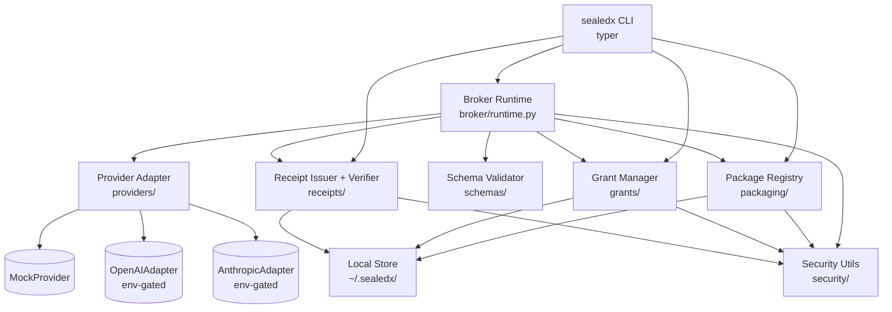

# Architecture

`sealedx` is a single Python package (`sealedx/`) plus a CLI entry point. There is no daemon and no network listener in v0. The runtime is exposed as a library (`sealedx.broker.execute(...)`) so a future FastAPI front end can wrap it without touching the core.

## Module layout

```
sealedx/
  cli.py                    # Typer app, no business logic
  broker/
    runtime.py              # Orchestrator: package + grant + input → result + receipt
    errors.py               # Typed exceptions; never carry prompt or key bytes
  packaging/
    models.py               # WorkflowPackage Pydantic model
    builder.py              # `vendor package` — hashes prompt + schemas, writes package json
    registry.py             # Load/list packages from $SEALEDX_HOME
  grants/
    models.py               # ExecutionGrant Pydantic model
    manager.py              # Create / load / expire / charge / list
    credentials.py          # Resolve provider creds from env at execution time
  providers/
    base.py                 # ProviderAdapter Protocol, ProviderRequest/Response
    registry.py             # name → adapter class
    mock.py                 # Deterministic, fixture-driven, default v0 adapter
    openai.py               # Optional, env-gated
    anthropic.py            # Optional, env-gated
    cost_table.py           # Per-model USD/Mtok cost estimates (clearly versioned + dated)
  receipts/
    models.py               # ExecutionReceipt Pydantic model
    issuer.py               # Build, canonicalize, sign
    verifier.py             # Re-derive hashes, verify Ed25519 signature
    canonical.py            # Canonical JSON serialization (sorted keys, no whitespace)
  schemas/
    validate.py             # jsonschema wrappers; consistent error shape
  security/
    hashing.py              # sha256 of bytes / canonical-json dicts
    keys.py                 # Ed25519 keypair load/generate; broker key id
    redaction.py            # Redacting logger + safe-error helpers
  storage/
    paths.py                # $SEALEDX_HOME resolution, atomic write helpers
    json_store.py           # Generic JSON read/write under a typed namespace
```

Each subpackage has a single responsibility and depends only on subpackages above it in the diagram below.

## Component diagram



Direction of dependencies is top-down. `security/` and `storage/` are leaves with no internal dependencies.

## Sequence: end-to-end execution

```mermaid
sequenceDiagram
    autonumber
    participant V as Vendor
    participant C as Customer
    participant CLI as sealedx CLI
    participant B as Broker Runtime
    participant R as Package Registry
    participant G as Grant Manager
    participant A as Provider Adapter
    participant RC as Receipt Issuer

    V->>CLI: sealedx vendor package ...
    CLI->>R: hash prompt + schemas, persist
    R-->>V: package_id

    C->>CLI: sealedx customer grant ...
    CLI->>G: create grant (provider, model, budget, expiry)
    G-->>C: grant_id

    C->>CLI: sealedx broker execute --pkg --grant --input
    CLI->>B: execute(pkg_id, grant_id, input)
    B->>R: load package
    B->>G: load grant; check active + budget + model match
    B->>B: validate input vs input_schema
    B->>A: complete(prompt, input, model)
    A-->>B: parsed_output, tokens_in, tokens_out
    B->>B: validate output vs output_schema
    B->>G: charge cost; persist
    B->>RC: issue signed receipt
    RC-->>B: receipt
    B-->>CLI: result + receipt
    CLI-->>C: result.json + receipt.json
```

## Extensibility points

Three explicit extension surfaces. Adding a new instance of any of them must not require changes to the broker runtime.

### 1. New provider adapter

Implement `ProviderAdapter` in `sealedx/providers/<name>.py`, register it in `providers/registry.py`. The broker treats all adapters identically.

Required:

- `name: str`
- `supports(model: str) -> bool`
- `complete(request: ProviderRequest) -> ProviderResponse`
- `estimate_cost_usd(tokens_in, tokens_out, model) -> Decimal`

Adapters must:

- Read credentials from environment at call time, never from disk state.
- Convert provider errors to `sealedx.providers.base.ProviderError` with a redacted message.
- Never log prompt or response bodies at INFO level.

### 2. New workflow package field

Add the field to `WorkflowPackage` (Pydantic), provide a default for backward compatibility, bump the package schema version field, and update the receipt's `policy_flags` if the field changes execution semantics. Old packages must continue to load.

### 3. New policy hook

Policy hooks fire at three points in the broker runtime: pre-validation, post-validation, post-execution. They are pure functions `(context) -> PolicyDecision` returning `allow | deny | flag`. v0 ships the policy framework with no hooks installed. Adding a hook does not change the receipt schema; flagged hooks append to `policy_flags`.

## Storage model

```
$SEALEDX_HOME/                      # default ~/.sealedx
  packages/<package_id>.json
  packages/<package_id>/prompt.md   # local-only; mode 0600
  packages/<package_id>/input.schema.json
  packages/<package_id>/output.schema.json
  grants/<grant_id>.json
  receipts/<execution_id>.json
  results/<execution_id>.json
  keys/broker_ed25519.key           # mode 0600; generated on first use
  keys/broker_ed25519.pub
```

All writes go through `storage/paths.atomic_write_json` (write to tmp → fsync → rename). Files are mode 0600 by default; key files explicitly so. The store is a simple JSON-on-disk structure; v0 does not need a database.

## Configuration

Environment variables, all optional:

- `SEALEDX_HOME` — override the local data directory.
- `SEALEDX_BROKER_KEY_ID` — override the public key id stamped into receipts (default `broker-dev-key-1`).
- `OPENAI_API_KEY`, `ANTHROPIC_API_KEY`, `HF_TOKEN` — only consulted by the corresponding adapter at execution time.

No configuration file in v0. CLI flags + env are sufficient.

## Error model

All broker errors derive from `sealedx.broker.errors.SealedxError`. Public attributes:

- `code: str` — machine identifier, used as receipt status when applicable (`invalid_input`, `invalid_output`, `budget_exceeded`, `grant_expired`, `provider_error`, `policy_denied`, `internal_error`).
- `message: str` — human-readable, **redacted**.
- `cause: BaseException | None` — captured for logs, never surfaced to the customer.

The CLI converts these to non-zero exits with a single-line message and a hint to `sealedx receipt verify <path>` for any receipt that was emitted.

## What is intentionally not in v0

- No daemon, no network listener.
- No database; JSON on disk.
- No DI container; explicit constructor wiring.
- No abstract base class for adapters — `Protocol` is sufficient.
- No global config object; functions take what they need.
- No retry layer in the broker — that lives in adapters per-provider, where the right answer is provider-specific.
- No streaming support in v0 (request/response only); receipts are easier to define against complete responses. Streaming is roadmapped.

## Why these boundaries

Two design constraints shaped the boundaries:

1. **The protocol must outlive the v0 implementation.** Package, grant, and receipt are stable data types. The broker runtime, the storage backend, and the adapter layer are all swappable. Lifting the runtime into a confidential-compute environment (Nitro, Confidential Space, AKS-CC) should not require touching the data model.

2. **Tests must run with no credentials.** That dictates a `Protocol`-based adapter interface and a deterministic mock as the canonical reference adapter. Real adapters are imported only when their credentials are present.
